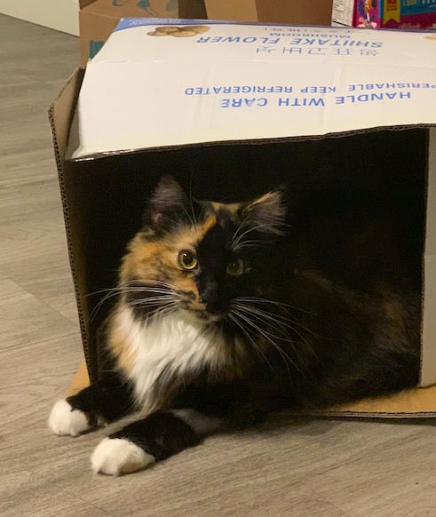
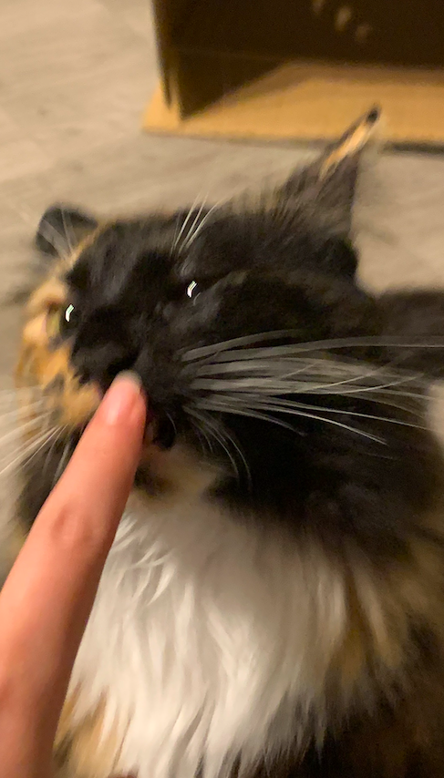
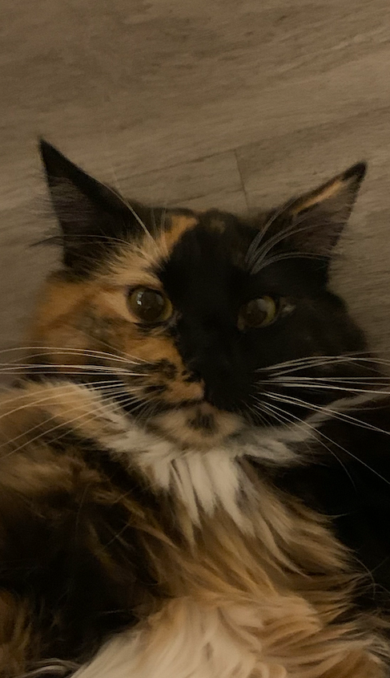

After staying at the hospital for a weekend, I survived a severe inner ear infection. I had three different kinds of medicine to facilitate my health conditions, but for sure, I was getting better. I even ate three small cans of wet food in only one day after heading back to my home. My humans took good care of me, and now I am kind of back to normal. I am still waiting for an appointment for a follow-up, and I hope everything will be alright.

<aside>
```{r, echo=FALSE}

```
</aside>

```{r, echo=FALSE}

```

```{r, echo=FALSE}

```

```{r setup, include=FALSE}
knitr::opts_chunk$set(echo = FALSE)
```


