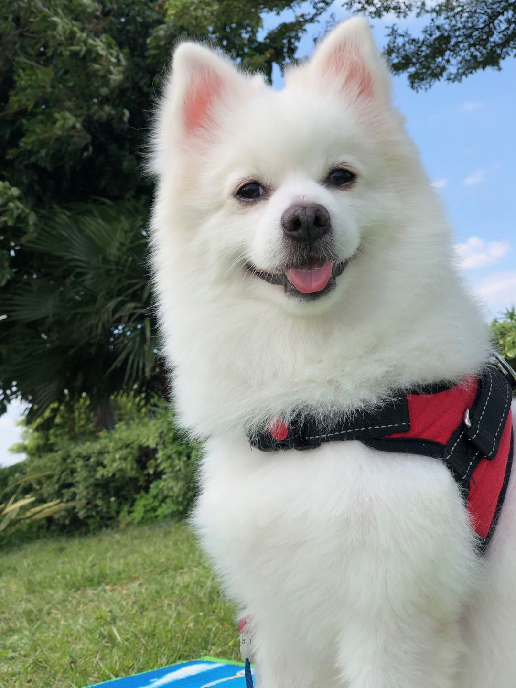

* That's my big brother Peter. He is a 5-year-old Japanese Spitz. 
 
```{r, echo=FALSE}

```

* My older sister was also once a stray cat. She was brought to home when she was only two months old. Back to then, she was so skinny that looked like an ET. Therefore, her name is ET. 

```{r, echo=FALSE}
knitr::include_graphics("images/et.jpeg")
```

* My little sister, HuiHui, was a Ragdoll. She was abandoned by one of my human's brother so she moved to live with my other siblings. 

```{r, echo=FALSE}
knitr::include_graphics("images/huihui.jpeg")
```


```{r setup, include=FALSE}
knitr::opts_chunk$set(echo = FALSE)
```


